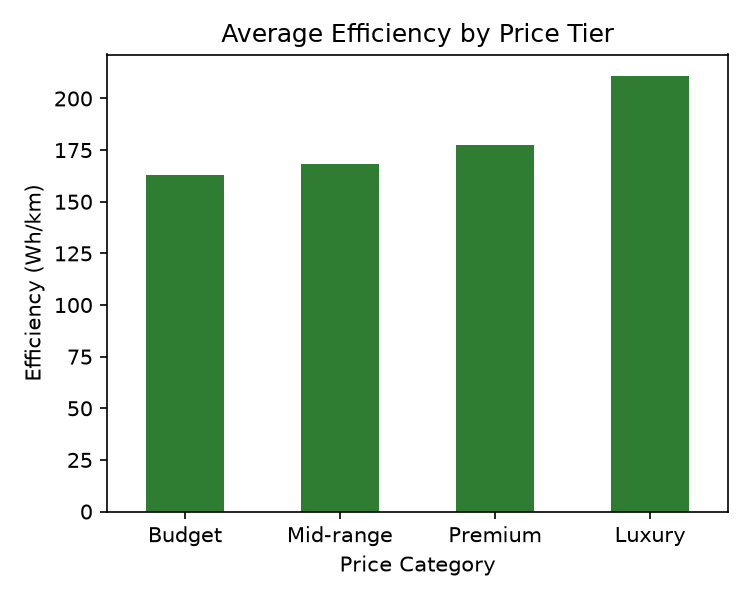
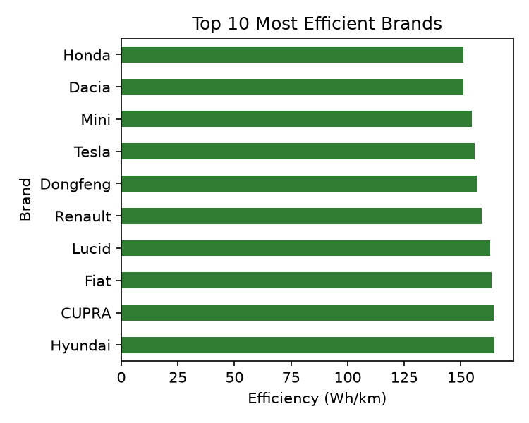
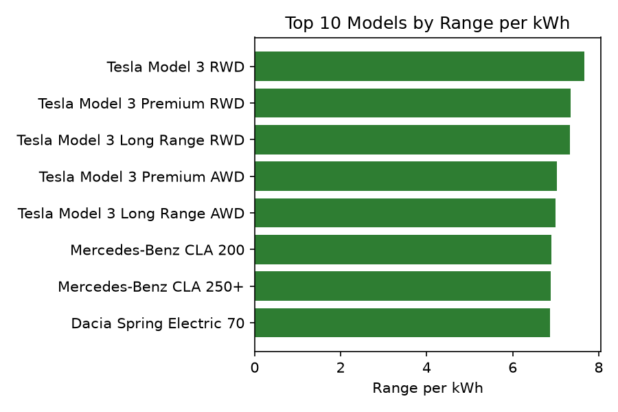

# ETL Pipeline: EV Market Decarbonization Analysis

ETL pipeline analyzing EV efficiency, range, and price data to explore decarbonization trends in the electric vehicle market.

**Author:** Narda Parama Agung Noviantoro

## Overview
This project builds an end-to-end ETL (Extract, Transform, Load) pipeline analyzing electric vehicle specifications to explore how efficiency and affordability are evolving in the EV market, two key indicators of how accessible clean transport is becoming.

Data is scraped from [ev-database.org](https://ev-database.org), covering 200 EV models across efficiency (Wh/km), range, battery capacity, price, and availability.

## Why This Matters
As a sustainability-focused analyst, I wanted to move beyond spec-sheet comparisons and ask real market questions:
- Is EV efficiency actually improving, or is the industry just building bigger batteries to fake better range?
- Is there a price penalty for efficiency, meaning is decarbonized transport becoming affordable, or still a luxury feature?
- Which brands are leading (or lagging) on efficiency?

## Tech Stack
- **Extraction:** Selenium (browser automation), BeautifulSoup (HTML parsing)
- **Transformation:** Pandas
- **Visualization:** Matplotlib
- **Storage:** PostgreSQL
- **Language:** Python, SQL

## Pipeline Overview
1. **Extract:** Selenium automates a Chrome browser to load ev-database.org, BeautifulSoup parses the rendered HTML to pull structured data across 200 vehicle listings
2. **Transform:** Cleans unit-embedded text (e.g. `"133 Wh/km"` becomes `133.0`), converts columns to proper numeric types, documents missing-value handling decisions
3. **Load:** Loads the cleaned dataset into a PostgreSQL database, with reasoning documented for why normalization wasn't required for this schema

## Key Findings

Note: lower Wh/km indicates higher efficiency, meaning the vehicle uses less energy per kilometer traveled. All findings below are based on 200 EV models.

### No Price Penalty for Efficiency, If Anything, the Opposite

Grouping vehicles into price tiers reveals a consistent, almost linear trend: average efficiency gets *worse* as price increases, from 163 Wh/km in the Budget tier, up to 169 Wh/km in Mid-range, 178 Wh/km in Premium, and 211 Wh/km in Luxury. This runs directly counter to the common assumption that a higher price buys more advanced, more efficient technology. In this dataset, the opposite is true: Budget EVs are the most efficient segment, not the least, and Luxury models trade efficiency away in favor of size, weight, and performance.

### Tesla Leads on Efficiency Without Being a Budget Brand

Ranking brands by average efficiency surfaces a mostly expected list, Dacia, Honda, and Mini lead, all budget-focused manufacturers. What stands out is Tesla, sitting 4th overall at 156 Wh/km, ahead of several other budget brands despite not being one itself. That positioning suggests Tesla's efficiency comes from deliberate engineering choices, not simply from building smaller or cheaper cars. Just as notable is who's missing: no luxury-oriented brand appears anywhere in the top 10, reinforcing the price-tier finding above from a different angle.

### Battery Size Alone Doesn't Predict Range

Battery production is the most resource- and mining-intensive part of an EV, so a model that delivers more range per kWh is achieving efficiency through genuine engineering, not just by installing a bigger battery, a meaningful distinction for assessing real sustainability progress. This ranking is dominated by a single nameplate: Tesla Model 3 variants take 7 of the top 10 spots, led by the Model 3 RWD at 7.67 km per kWh. Given Tesla's efficiency score was already near the top of the brand comparison, this result reinforces the same conclusion from a different angle, Tesla's advantage isn't marginal, it's a consistently better ratio of usable range to battery size than most competitors manage.

This challenges a common assumption that premium innovation trickles down to make clean transport more accessible over time. Instead, the data suggests genuine decarbonization progress is currently led by manufacturers designing for efficiency from the ground up, often in accessible segments, rather than by luxury models setting the pace. For a market still working toward making clean transport genuinely accessible, the more useful question may not be "how do we make efficient EVs cheaper," but "why aren't more manufacturers building as efficiently as the segment leaders already are."

All three findings are demonstrated twice in this project: once in Pandas (notebook, with the charts above) and once in pure SQL (`ev_market_decarbonization_analysis_load.sql`), to show the same analytical questions can be answered at either the application layer or the database layer.

## Repository Structure
- `ev_market_decarbonization_analysis_extract_transform.ipynb`: Extract, Transform, and Key Findings (Pandas)
- `ev_market_decarbonization_analysis_load.sql`: Load and Exploratory Queries (SQL)
- `raw_data_EV_Sustainability.csv`: Scraped, unprocessed data
- `clean_data_EV_Sustainability.csv`: Cleaned, analysis-ready data
- `images/`: Chart images referenced in this README
- `README.md`

## How to Run
1. Install dependencies: `pip install pandas selenium beautifulsoup4 matplotlib`
2. Run the notebook cells in order to scrape, clean, and visualize the data
3. Copy the cleaned CSV to a location PostgreSQL can read (e.g. `/tmp/`), matching the path used in the `COPY` statement
4. Set up a PostgreSQL database and run `ev_market_decarbonization_analysis_load.sql` to load the cleaned data and run the exploratory queries
